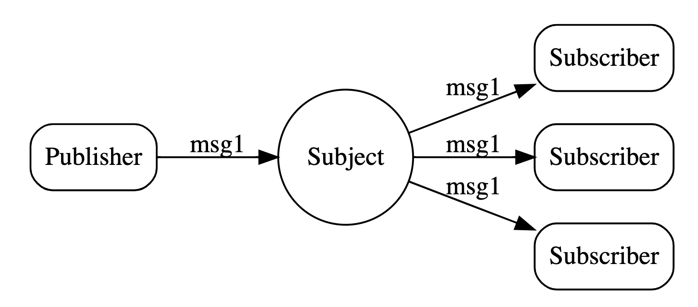
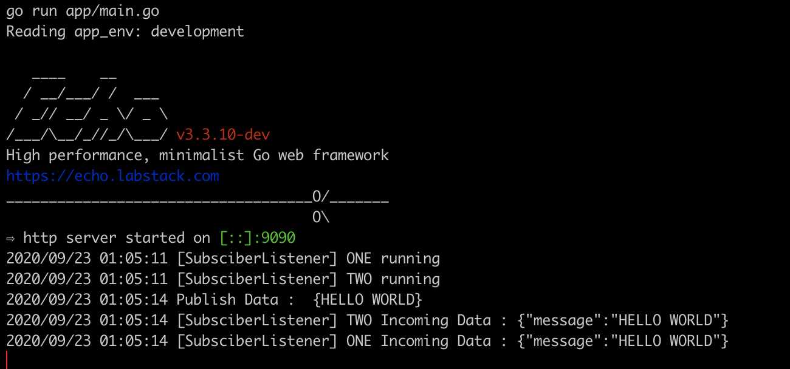
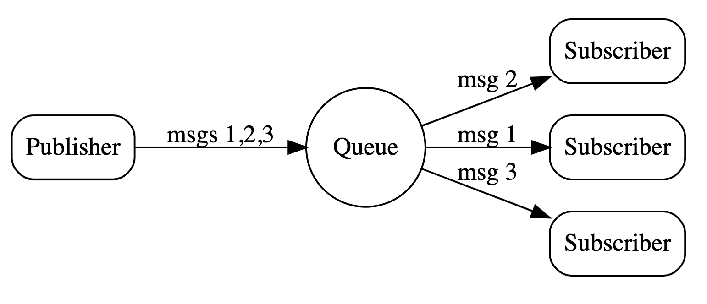

# Go Nats

## Overview

NATS is an open source, lightweight, high-performance cloud native infrastructure messaging system. It implements a highly scalable and elegant publish-subscribe (pub/sub) distribution model. The performant nature of NATS make it an ideal base for building modern, reliable, scalable cloud native distributed systems.

Implemented with clean architecture by Uncle Bob in folder structure. Hopefully make you easier to implement this message broker.

## Stack
So basically, this app was build using:

* Golang
* Nats

## Prerequisite
* Install go v1.11 or above to use go modules
* Make vendored copy of depedencies
    ```shell
        go mod vendor
    ```
* Copy app.config.sample yml into decided environment. For example:
    ```shell
        cp app.config.sample.yml app.config.dev.yml
    ```
* Fill the yml values
* Make sure your nats  is ready (docker will help your life)
* You can use `go-nats.postman_collection.json` to test this repository
    
## Usage
1. Manual run
    ```shell
        make start
    ```
2. Bash script
   ```shell
        bash run.sh
    ```

## Images
In this repo, there are two feature that implemented so far:
* Asynchronous Subscriptions
    
    
    Here is response :
    

* Queue Subscriptions

    
    Here is response :
    


## Reference
* Golang Clean Architecture Implementation by [Iman](https://medium.com/hackernoon/golang-clean-archithecture-efd6d7c43047).
* [Nats.io](https://docs.nats.io/nats-concepts/intro) concept.
* [Goldi Lazy Injection](https://github.com/fgrosse/goldi) concept.
